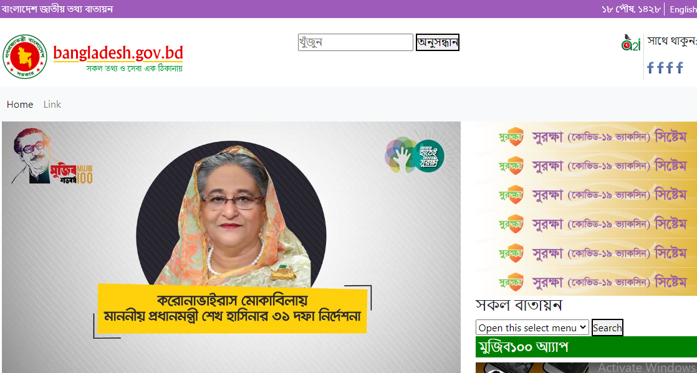

  

# Web Development for 5th Semester Computer, IIST
 👉 Create a Web Design using HTML,CSS, JS &amp; Bootstrap Project-1  
---
### Youtube Link of Web Design  
[Web Design-Project](https://youtu.be/aqvRafv_5nc)  
---
 ### Playlists Link for Web Design & Web Development of me  
1. [Web Design Project-1](https://www.youtube.com/playlist?list=PLxqLmn_MNa-Sl7EtwOFCV4zWEwleEd3mk)  
2. [Web Design Project-2](https://www.youtube.com/playlist?list=PLxqLmn_MNa-Rfie-DoTgRRnUnXxZKGZip)  
3. [Web Development Level-IV Certificate](https://www.youtube.com/playlist?list=PLxqLmn_MNa-Sv8NyBi2i97qDElbCeWcdW)
---

### Useful Resources for Web Design for Free Downloadable Images & Videos : 
1. [Unsplash](https://unsplash.com/)
2. [Pixa Bay](https://pixabay.com/)
3. [Pexels](https://www.pexels.com/)  
4. [Free Images](https://www.freeimages.com/)    

### Useful Resources for Web Design for Free Downloadable Illustrations:   
1. [Undraw](https://undraw.co)
2. [Free Pik](https://www.freepik.com)
3. [Vecteezy](https://www.vecteezy.com/)
4. [Storyset](https://storyset.com/)     

### Usable Gradient Colors Source:  
- [Web Gradients](https://webgradients.com/)  
- [CSS Gradient](https://cssgradient.io/)   

### Useful Resources for Web Design for Free Downloadable for icons  
- [Free Icons](https://freeicons.io/)  
- [Flat Icons](https://www.flaticon.com/)  

### Useful Resources for Web Design for Free Downloadable for background remove from Image
- [Remove BG](https://www.remove.bg/)
- [Adobe BG](https://www.adobe.com/express/feature/image/remove-background)

### Useful Resources for Web Design for Free Downloadable for Photo Editor & Design Maker
- [Pix Lr](https://pixlr.com/e/) 
- [Picture Resize](https://picresize.com/) 
- [Adobe Resize](https://www.adobe.com/express/feature/image/resize) 
- [Biteable](https://biteable.com/tools/image-resizer/) 

---  

 ### HTML Code  
~~~html
<!DOCTYPE html>
<html lang="en">
<head>
	<meta charset="UTF-8">
	<meta http-equiv="X-UA-Compatible" content="IE=edge">
	<meta name="viewport" content="width=device-width, initial-scale=1.0">
	<title>Design</title>
	<link rel="stylesheet" href="style.css">
	<link rel="stylesheet" href="assets/css/bootstrap.min.css">
</head>
<body>
<!-- header part start -->
<header>
	

		

			

				
বাংলাদেশ জাতীয় তথ্য বাতায়ন

			

			

				
১৮ পৌষ, ১৪২৮

				<a href="">English</a>
			

		

	

</header>
<!-- header part end -->
<!-- logo part start -->
<section>
	

		

			

				
			

			

				<form action="">
					<input type="text" placeholder="খুঁজুন ">
					<button>অনুসন্ধান </button>
				</form>
			

			

				

					
				

				

					
সাথে থাকুন:

					
					
					
					
				

			

		

	

</section>
<!-- logo part end -->
<!-- menu part start -->
<section>
	

		

			<nav class="navbar navbar-expand-lg bg-light">
				

				  
				  

					<ul class="navbar-nav me-auto mb-2 mb-lg-0">
					  <li class="nav-item">
						<a class="nav-link active" aria-current="page" href="#">Home</a>
					  </li>
					  <li class="nav-item">
						<a class="nav-link" href="#">Link</a>
					  </li>
					  
					</ul>
				
				  

				

			  </nav>
		

	

</section>
<!-- menu part end -->
<!-- hero part start -->
<section>
	

		

			

				<!-- image part start -->
				

					
				

				<!-- marquee part start -->
				

					<h4><marquee behavior="" direction="">
						Lorem ipsum dolor sit amet consectetur adipisicing elit. Aliquid labore voluptas quod totam ullam incidunt!
					</marquee></h4>
				

				<!-- slider part start -->
				

					

						

						  

							
						  

						  

							
						  

						  

							
						  

						

						
					  

				

				<!-- tabs part start -->
				

					<ul class="nav nav-pills mb-3" id="pills-tab" role="tablist">
						<li class="nav-item" role="presentation">
						  <button class="nav-link active" id="pills-home-tab" data-bs-toggle="pill" data-bs-target="#pills-home" type="button" role="tab" aria-controls="pills-home" aria-selected="true">জনপ্রিয় সেবা</button>
						</li>
						<li class="nav-item" role="presentation">
						  <button class="nav-link" id="pills-profile-tab" data-bs-toggle="pill" data-bs-target="#pills-profile" type="button" role="tab" aria-controls="pills-profile" aria-selected="false">নতুন সেবা</button>
						</li>
						<li class="nav-item" role="presentation">
						  <button class="nav-link" id="pills-contact-tab" data-bs-toggle="pill" data-bs-target="#pills-contact" type="button" role="tab" aria-controls="pills-contact" aria-selected="false">মোবাইল সেবা</button>
						</li>
						<li class="nav-item" role="presentation">
						  <button class="nav-link" id="pills-disabled-tab" data-bs-toggle="pill" data-bs-target="#pills-disabled" type="button" role="tab" aria-controls="pills-disabled" aria-selected="false" disabled>Disabled</button>
						</li>
					  </ul>
					  

						

							

								

									
									
অর্থ ও বাণিজ্য

								

								

									
									

										অনলাইন আবেদন                                

								

								

									
									
অর্থ ও বাণিজ্য

								

								

									
									
অর্থ ও বাণিজ্য

								

								

									
									
অর্থ ও বাণিজ্য

								

								

									
									
অর্থ ও বাণিজ্য

								

								

									
									
অর্থ ও বাণিজ্য

								

								

									
									
অর্থ ও বাণিজ্য

								

							

						

						

							

								

									
									

										মৎস্য ও প্রাণী                            

								

								

									
									

										অনলাইন আবেদন                                

								

								

									
									
অর্থ ও বাণিজ্য

								

								

									
									
অর্থ ও বাণিজ্য

								

								

									
									
অর্থ ও বাণিজ্য

								

								

									
									
অর্থ ও বাণিজ্য

								

								

									
									
অর্থ ও বাণিজ্য

								

								

									
									
অর্থ ও বাণিজ্য

								

							

						

						
..3.

						
...

					  

				

				<!-- other part start -->
				

			

			

				<!-- sidebar image start -->
				

					
					
					
					
					
					
				

				<!-- sidebar video start -->
				

					<h4>সকল বাতায়ন</h4>
					<form action="">
						<select>
							<option selected>Open this select menu</option>
							<option value="1">One</option>
							<option value="2">Two</option>
							<option value="3">Three</option>
						  </select>
						  <button>Search</button>
					</form>
					<h5>মুজিব১০০ আ্যাপ</h5>
					<iframe width="362" height="200" src="https://www.youtube.com/embed/4Om3kZJL-qU" title="YouTube video player" frameborder="0" allow="accelerometer; autoplay; clipboard-write; encrypted-media; gyroscope; picture-in-picture" allowfullscreen></iframe>
					<h5>মাস্ক পরুন সেবা নিন</h5>
					
					<h4>ডেঙ্গু প্রতিরোধে করণীয়</h4>
					
				

			

		

	

</section>
<!-- hero part end -->
<footer>
	

		

			
		

		

			

				<nav class="navbar navbar-expand-lg bg-light">
					

					  
					  

						<ul class="navbar-nav me-auto mb-2 mb-lg-0">
						  <li class="nav-item">
							<a class="nav-link active" aria-current="page" href="#">Home</a>
						  </li>
						  <li class="nav-item">
							<a class="nav-link" href="#">Link</a>
						  </li>
						  
						</ul>
					
					  

					

				  </nav>
			

			

				
পরিকল্পনা ও বাস্তবায়নে: এটুআই, মন্ত্রিপরিষদ বিভাগ, বিসিসি, বেসিস, ডিওআই

				
			

		

	

</footer>
	

	
</body>
</html>
~~~  

### Style.css code  

~~~css
*{
    margin: 0;
    padding: 0;
}

.header_cont{
    height: 30px; 
    background: #9e5bba;
    color: #fff;
    font-size: 14px;
    padding: 5px;
}
.header_right p{
    display: inline-block;
    border-right: 1px solid #fff;
    padding-right: 5px;
    margin-right: 5px;
}
.header_right a{
    color: #fff;
    text-decoration: none;
}
/* logo part start */
.logo{
height: 110px;
padding: 25px;
}
.logo1{
    border-right: 1px solid #ddd;
    padding-right: 5px;
    margin-right: 5px;
}
/* logo part end */
.sidebar_video h5{
    background: green;
    padding: 5px;
    color: #fff;
}
~~~
